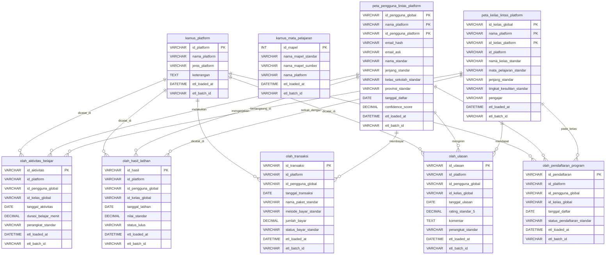

# Diagram ERD Database Staging dan Schema DWH

Dokumen ini mencerminkan struktur tabel yang saat ini didefinisikan di `db_staging_mysql.sql` dan `db_warehouse_mysql.sql`.

## 1. ERD Database Staging (`db_staging_mysql.sql`)

## 2. Schema DWH Data Warehouse (`db_warehouse_mysql.sql`)

```mermaid
erDiagram
    dim_waktu {
        BIGINT waktu_key PK
        DATE tanggal
        INT bulan
        VARCHAR nama_bulan
        VARCHAR kuartal
        INT tahun
        TIMESTAMP etl_loaded_at
        VARCHAR etl_batch_id
    }
    dim_platform {
        BIGINT platform_key PK
        VARCHAR id_platform
        VARCHAR nama_platform
        VARCHAR jenis_platform
        TIMESTAMP etl_loaded_at
        VARCHAR etl_batch_id
    }
    dim_mata_pelajaran {
        BIGINT mata_pelajaran_key PK
        VARCHAR nama_mata_pelajaran
        VARCHAR kategori
        TIMESTAMP etl_loaded_at
        VARCHAR etl_batch_id
    }
    dim_jenjang {
        BIGINT jenjang_key PK
        VARCHAR nama_jenjang
        INT tingkat
        TIMESTAMP etl_loaded_at
        VARCHAR etl_batch_id
    }
    dim_pengguna {
        BIGINT pengguna_key PK
        VARCHAR id_pengguna_sumber
        BIGINT platform_key FK
        VARCHAR nama_pengguna
        VARCHAR email
        VARCHAR provinsi
        DATE tanggal_daftar
        TIMESTAMP etl_loaded_at
        VARCHAR etl_batch_id
    }
    dim_kelas {
        BIGINT kelas_key PK
        VARCHAR id_kelas_sumber
        BIGINT platform_key FK
        VARCHAR nama_kelas
        BIGINT mata_pelajaran_key FK
        BIGINT jenjang_key FK
        VARCHAR tingkat_kesulitan_standar
        TIMESTAMP etl_loaded_at
        VARCHAR etl_batch_id
    }
    dim_perangkat {
        BIGINT perangkat_key PK
        VARCHAR kategori_perangkat
        TIMESTAMP etl_loaded_at
        VARCHAR etl_batch_id
    }
    dim_paket {
        BIGINT paket_key PK
        VARCHAR jenis_paket
        TIMESTAMP etl_loaded_at
        VARCHAR etl_batch_id
    }
    dim_metode_bayar {
        BIGINT metode_bayar_key PK
        VARCHAR nama_metode
        VARCHAR kategori_metode
        TIMESTAMP etl_loaded_at
        VARCHAR etl_batch_id
    }

    fakta_pendaftaran_program {
        BIGINT pendaftaran_fact_key PK
        BIGINT waktu_key FK
        BIGINT platform_key FK
        BIGINT pengguna_key FK
        BIGINT kelas_key FK
        VARCHAR id_pendaftaran_sumber
        VARCHAR status_pendaftaran
        TINYINT aktif_flag
        TINYINT batal_flag
        TIMESTAMP etl_loaded_at
        VARCHAR etl_batch_id
    }
    fakta_aktivitas_belajar {
        BIGINT aktivitas_fact_key PK
        BIGINT waktu_key FK
        BIGINT platform_key FK
        BIGINT pengguna_key FK
        BIGINT kelas_key FK
        BIGINT perangkat_key FK
        VARCHAR id_aktivitas_sumber
        INT durasi_menit
        TIMESTAMP etl_loaded_at
        VARCHAR etl_batch_id
    }
    fakta_hasil_latihan {
        BIGINT hasil_fact_key PK
        BIGINT waktu_key FK
        BIGINT platform_key FK
        BIGINT pengguna_key FK
        BIGINT kelas_key FK
        VARCHAR id_hasil_sumber
        DECIMAL nilai_standar
        VARCHAR status_lulus
        TINYINT lulus_flag
        TIMESTAMP etl_loaded_at
        VARCHAR etl_batch_id
    }
    fakta_transaksi {
        BIGINT transaksi_fact_key PK
        BIGINT waktu_key FK
        BIGINT platform_key FK
        BIGINT pengguna_key FK
        BIGINT paket_key FK
        BIGINT metode_bayar_key FK
        VARCHAR id_transaksi_sumber
        DECIMAL jumlah_bayar
        VARCHAR status_bayar
        TINYINT berhasil_flag
        TINYINT gagal_flag
        TINYINT pending_flag
        TIMESTAMP etl_loaded_at
        VARCHAR etl_batch_id
    }
    fakta_ulasan {
        BIGINT ulasan_fact_key PK
        BIGINT waktu_key FK
        BIGINT platform_key FK
        BIGINT pengguna_key FK
        BIGINT kelas_key FK
        VARCHAR id_ulasan_sumber
        DECIMAL rating_standar_5
        TINYINT komentar_tersedia_flag
        TIMESTAMP etl_loaded_at
        VARCHAR etl_batch_id
    }

    dim_platform ||--o{ dim_pengguna : "dipakai_oleh"
    dim_platform ||--o{ dim_kelas : "dipakai_oleh"
    dim_mata_pelajaran ||--o{ dim_kelas : "dipakai_oleh"
    dim_jenjang ||--o{ dim_kelas : "dipakai_oleh"

    dim_waktu ||--o{ fakta_pendaftaran_program : "saat"
    dim_platform ||--o{ fakta_pendaftaran_program : "menyediakan"
    dim_pengguna ||--o{ fakta_pendaftaran_program : "mendaftar"
    dim_kelas ||--o{ fakta_pendaftaran_program : "diikuti"

    dim_waktu ||--o{ fakta_aktivitas_belajar : "saat"
    dim_platform ||--o{ fakta_aktivitas_belajar : "menyediakan"
    dim_pengguna ||--o{ fakta_aktivitas_belajar : "melakukan"
    dim_kelas ||--o{ fakta_aktivitas_belajar : "diikuti"
    dim_perangkat ||--o{ fakta_aktivitas_belajar : "menggunakan"

    dim_waktu ||--o{ fakta_hasil_latihan : "saat"
    dim_platform ||--o{ fakta_hasil_latihan : "menyediakan"
    dim_pengguna ||--o{ fakta_hasil_latihan : "mengerjakan"
    dim_kelas ||--o{ fakta_hasil_latihan : "dari_kelas"

    dim_waktu ||--o{ fakta_transaksi : "saat"
    dim_platform ||--o{ fakta_transaksi : "melayani"
    dim_pengguna ||--o{ fakta_transaksi : "membayar"
    dim_paket ||--o{ fakta_transaksi : "membeli"
    dim_metode_bayar ||--o{ fakta_transaksi : "melalui"

    dim_waktu ||--o{ fakta_ulasan : "saat"
    dim_platform ||--o{ fakta_ulasan : "mendapat"
    dim_pengguna ||--o{ fakta_ulasan : "memberikan"
    dim_kelas ||--o{ fakta_ulasan : "ditujukan_pada"
```

